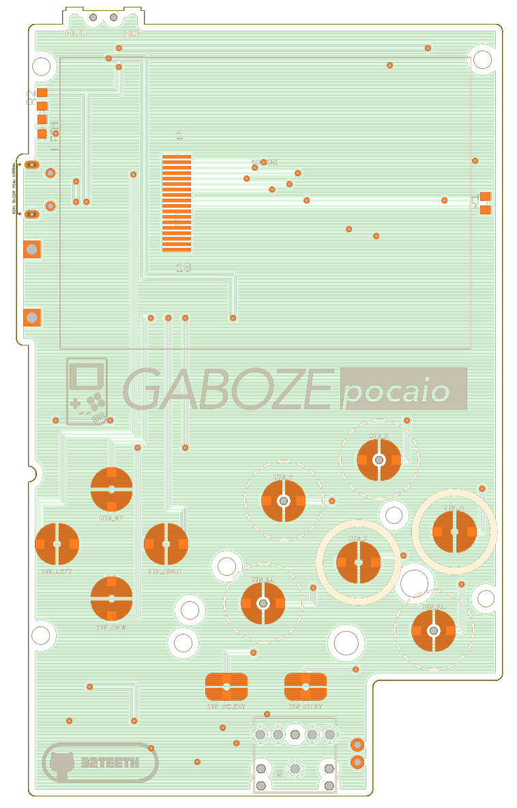
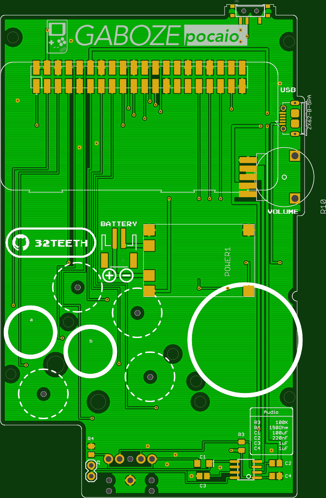
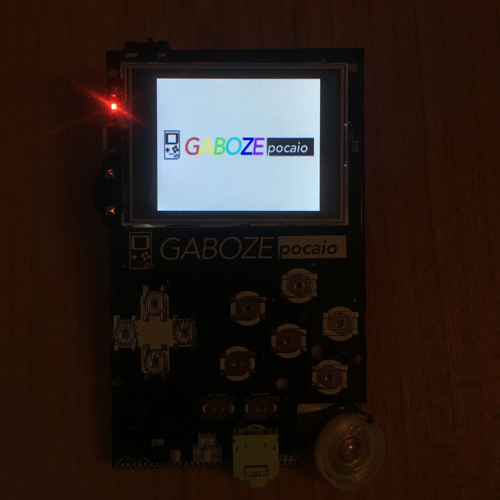
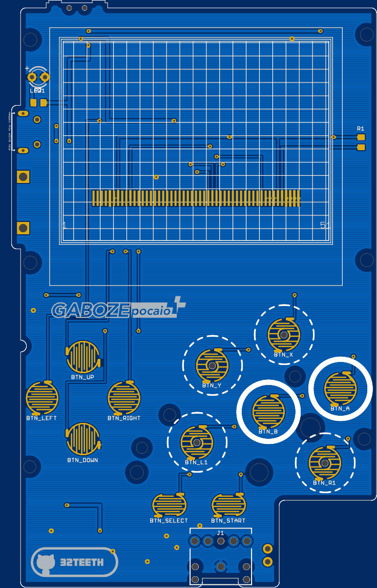

-----

# Where Can I Buy One
> You can purchase an assembled Gaboze Pocaio on [Tindie](https://www.tindie.com/products/thirtytwoteeth/gaboze-pocaio-game-boy-pocket-all-in-one/)

-----

## Introduction

### Gaboze Pocaio - Pocket All In One
Raspberry Pi Zero based arcade in you pocket, and in your Gameboy Pocket

### Features:

* 2.4" TFT LCD
* Gameboy button layout interface
* Raspberry Pi Zero
* Battery Charger (TP4056 Module)
* Headphone Jack (LM4857)
* Speaker capability (LM4857)

### Platforms:

The boards have been tested with the following platforms:

- [x] [Emulation Station](http://www.emulationstation.org/)
- [x] [Lakka](http://www.lakka.tv/)
- [x] [RetroPie](https://retropie.org.uk/)

## DIY
> Building this yourself? Read the [Wiki](https://github.com/GameboyZero/GabozePocaio/wiki/)
* [Preperation](https://github.com/GameboyZero/GabozePocaio/wiki/DIY---Preperation)
* [Sound](https://github.com/GameboyZero/GabozePocaio/wiki/DIY---Sound-Components)
* [Display](https://github.com/GameboyZero/GabozePocaio/wiki/DIY---TFT-Display)

## Details
> The source files have been officially released. Check out the [Files](https://github.com/GameboyZero/GabozePocaio/tree/master/eagle/Release) and build away

| Top                                                          | Bottom                                                                          |Money Shot                   |
| ------------------------------------------------------------ | ------------------------------------------------------------ |-----------                   |
|  |  |  |

## Plus Edition
> This is a 2.6" TFT version of the Gaboze Pocaio. The Gerber Files are in the [Plus](https://github.com/GameboyZero/GabozePocaio/tree/master/gerber/Plus) folder

| Top                                                          | Bottom   |Prototype Shot                   |
| ------------------------------------------------------------ | ------------------------------------------------------------ |-----------                   |
|  |  | |

# Buy me a Coffee
> This is a labor of love, and much time has been put in...  ...i could use a [coffee](https://www.paypal.me/32teeth/1usd) *(donuts are okay too)*

**Thank you for your support**

## Seriously
> READ THE [WIKI](https://github.com/GameboyZero/GabozePocaio/wiki/)

