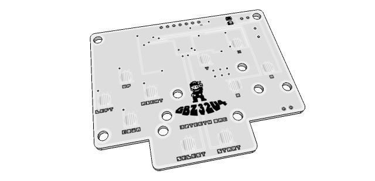
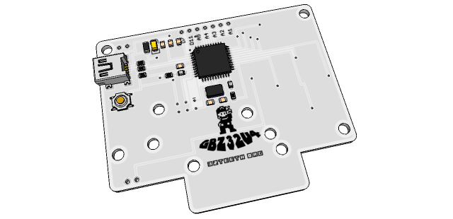

## Gameboy Zero

##### Pocket Edition

Gameboy Zero Pocket Edition is a refactor of the [Sudomod](http://sudomod.com/) Communities Gameboy Zero board. It is designed for an Atmega32u4 (so you can blast it with Arduino as well)

Below is a list of pin and port assignment

#### IO Pins

| Atmega32u4  | Arduino | GBZ32u4 |
| ----------- | ------- | ------- |
| PF7 (ADC7)  | A0      | Speaker |
| PD1 (SDA)   | D2      | Select  |
| PD0 (SCL)   | D3      | Start   |
| PD4 (ADC8)  | D4      | Right   |
| PC6         | D5      | A       |
| PD7 (ADC10) | D6      | Up      |
| PB4 (ADC11) | D8      | Left    |
| PB5 (ADC12) | D9      | Y       |
| PB6 (ADC13) | D10     | X       |
| PD6 (ADC9)  | D12     | Down    |
| PC7         | D13     | B       |

#### Breakout Pins

| Atmega32u4 | Arduino | GBZ32u4                                 |
| ---------- | ------- | --------------------------------------- |
| PF6 (ADC6) | A1      | Unassigned Available On Header Breakout |
| PF5 (ADC5) | A2      | Unassigned Available On Header Breakout |
| PF4 (ADC4) | A3      | Unassigned Available On Header Breakout |
| PF1 (ADC1) | A4      | Unassigned Available On Header Breakout |
| PF0 (ADC0) | A5      | Unassigned Available On Header Breakout |
| PE6        | D7      | Unassigned Available On Header Breakout |

**note: the breakout pins available at the top of the board are intended to be used for other communications to other devices (ex: raspberry pi, tft screen…) or input from other devices (esp devices, whatever…)*

#### Images

