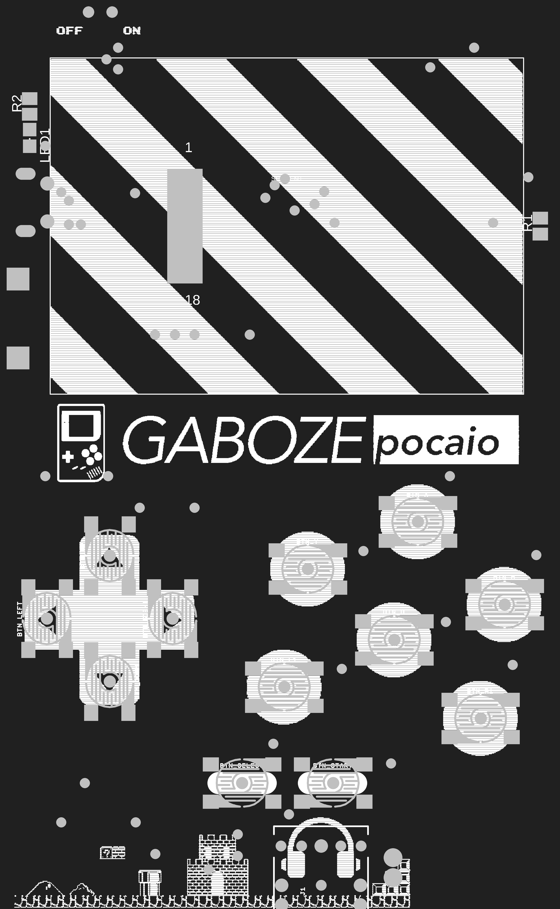
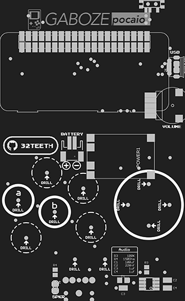

## Introduction

### Gaboze Pocaio - Pocket All In One
Raspberry Pi Zero based arcade in you pocket, and in your Gameboy Pocket

### Features:

* 2.4" TFT LCD
* Gameboy button layout interface
* Raspberry Pi Zero
* Battery Charger (TP4056 Module)
* 60 frames per second display
* Headphone Jack (LM4857)
* Speaker capability (LM4857)

### Platforms:

The boards have been tested with the following platforms:

- [x] [Emulation Station](http://www.emulationstation.org/)
- [ ] [Lakka](http://www.lakka.tv/) - **Open Bounty** - Get Frame Buffer to work on ILI9341 Display! *<u>(Get in Touch)</u>*
- [x] [RetroPie](https://retropie.org.uk/)

## Components
> Building this yourself? Read the [Wiki](https://github.com/GameboyZero/GabozePocaio/wiki/)
* [Preperation](https://github.com/GameboyZero/GabozePocaio/wiki/DIY---Preperation)
* [Sound](https://github.com/GameboyZero/GabozePocaio/wiki/DIY---Sound-Components)
* [Display](https://github.com/GameboyZero/GabozePocaio/wiki/DIY---TFT-Display)

## Details

| Top                                                          | Bottom                                                       | Money Shot                   |
| ------------------------------------------------------------ | ------------------------------------------------------------ | ---------------------------- |
|  |  |  |

## 3D Model
* [Standalone Board](https://gameboyzero.github.io/GabozePocaio/)
* [With Shell](https://gameboyzero.github.io/GabozePocaio/?shell)

# Buy me a Coffee
> This is a labor of love, and much time has been put in...  ...i could use a [coffee](https://www.paypal.me/32teeth/1usd) *(donuts are okay too)*

**Thank you for your support**

## Seriously
> READ THE [WIKI](https://github.com/GameboyZero/GabozePocaio/wiki/)

