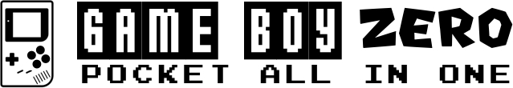
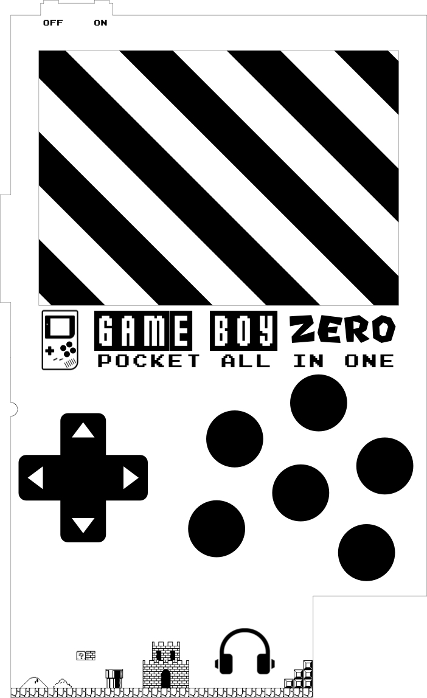
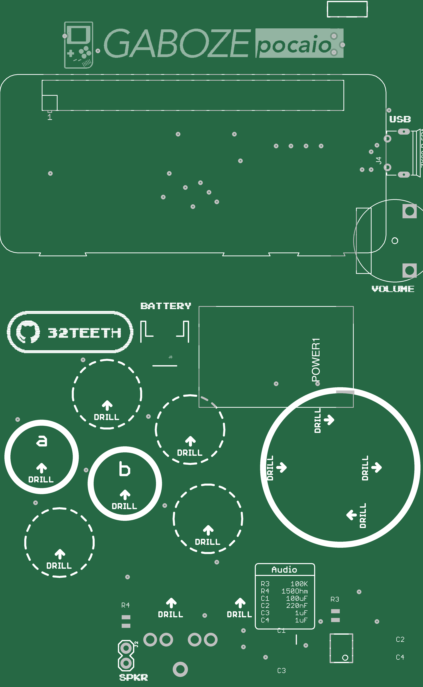

# Gaboze Pocaio
> Gaboze Pocaio is a concatenation Game Boy Zero Pocket All In One

* **Ga**me
* **Bo**y
* **Ze**ro
* **Poc**ket
* **A**ll
* **I**n
* **O**ne

## Introduction

### Gameboy Zero - Pocket All In One
Raspberry Pi Zero based arcade in you pocket, and in your Gameboy Pocket

### Features:

* 2.4" TFT LCD
* Gameboy button layout interface
* Raspberry Pi Zero
* Battery Charger (TP4056 Module)
* 60 frames per second display
* Headphone Jack (LM4857)
* Speaker capability (LM4857)

### Platforms:

The boards have been tested with the following platforms:

- [x] [Emulation Station](http://www.emulationstation.org/)
- [ ] [Lakka](http://www.lakka.tv/) - **Open Bounty** - Get Frame Buffer to work on ILI9341 Display! *<u>(Get in Touch)</u>*
- [x] [RetroPie](https://retropie.org.uk/)

Other platforms are yet to be tested.

#### Eagle CAD Library

With our project we have included a few custom Eagle CAD Libraries

* [Buttons](/library/GameboyZeroButtonLibrary.lbr)
* [Displays](/library/GameboyZeroHandheldDisplays.lbr)
* [Raspberry Pi Zero](/library/RPI-Zero.lbr)

## Details

| Top                                                          | Bottom                                                       | Money Shot                                                       |
| ------------------------------------------------------------ | ------------------------------------------------------------ | ------------------------------------------------------------ |
|  |  | 

## 3D Model
[Check it out here](https://32teeth.github.io/GameboyZeroPocket/)
