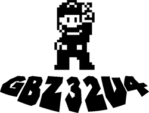
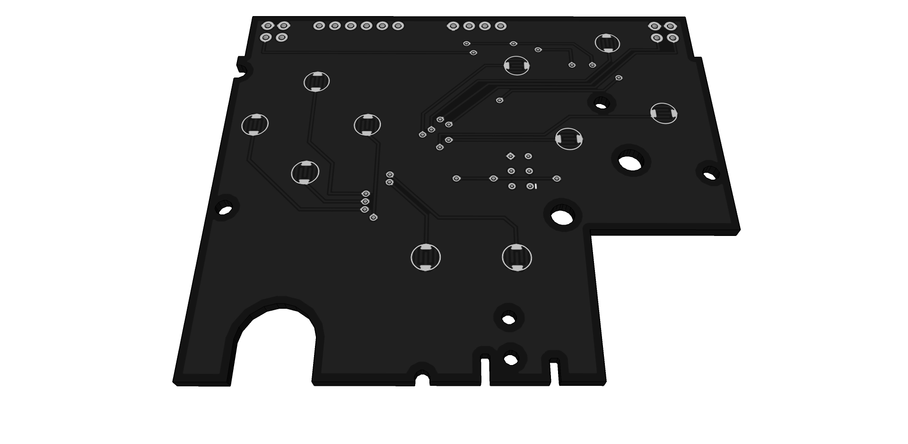
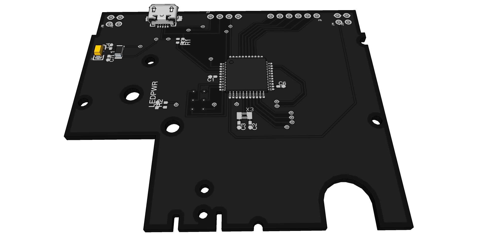

## Gameboy Zero

##### Pocket Edition

Gameboy Zero Pocket Edition is a refactor of the [Sudomod](http://sudomod.com/) Communities Gameboy Zero board. It is designed for an Atmega32u4 (so you can blast it with Arduino as well)

Below is a list of pin and port assignment

#### IO Pins

| Atmega32u4 | Arduino | GBZ32u4 |
| ---------- | ------- | ------- |
| PD2        | D0      | DOWN    |
| PD3        | D1      | UP      |
| PD1        | D2      | LEFT    |
| PD0        | D3      | RIGHT   |
| PD4        | D4      | A       |
| PC6        | D5      | START   |
| PD7        | D6      | Y       |
| PE6        | D7      | L1      |
| PB4        | D8      | X       |
| PB5        | D9      | R1      |
| PB6        | D10     | R2      |
| PB7        | D11     | L2      |
| PD6        | D12     | B       |
| PC7        | D13     | SELECT  |

#### Breakout Pins

| Atmega32u4 | Arduino | GBZ32u4                                 |
| ---------- | ------- | --------------------------------------- |
| PF7 (ADC7) | A0      | Unassigned Available On Header Breakout |
| PF6 (ADC6) | A1      | Unassigned Available On Header Breakout |
| PF5 (ADC5) | A2      | Unassigned Available On Header Breakout |
| PF4 (ADC4) | A3      | Unassigned Available On Header Breakout |
| PF1 (ADC1) | A4      | Unassigned Available On Header Breakout |
| PF0 (ADC0) | A5      | Unassigned Available On Header Breakout |

**note: the breakout pins available at the top of the board are intended to be used for other communications to other devices (ex: raspberry pi, tft screen…) or input from other devices (esp devices, whatever…)*

#### Images

